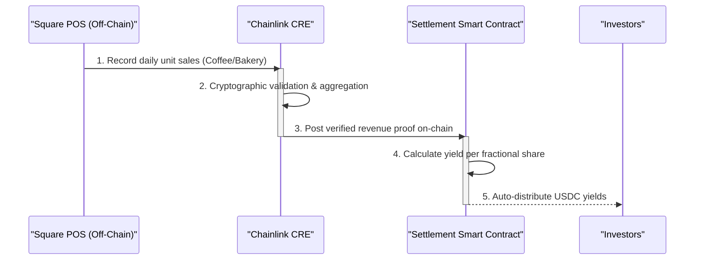
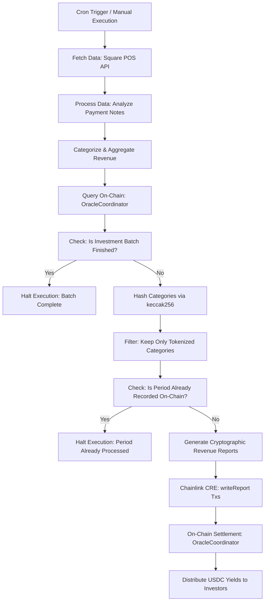
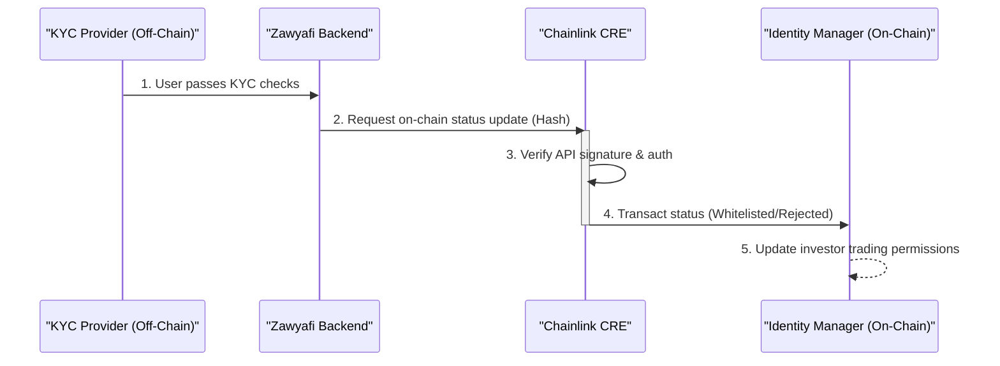
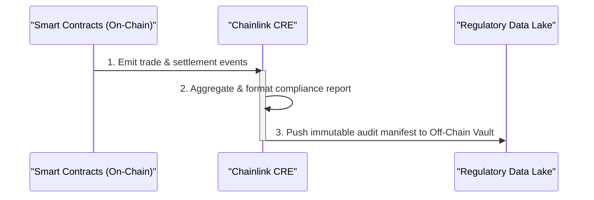

<div align="center">

# <a href="https://www.zawyafi.com/"> Zawyafi</a>

**Institutional-Grade Web3 Infrastructure for Real-World Asset (RWA) Investments**

[](https://chain.link/chainlink-runtime-environment)
[](https://opensource.org/licenses/MIT)

*Connecting Main Street to Decentralized Finance through Chainlink CRE.*

</div>

---

## 1. Project Overview

**Zawyafi** is a fully compliant, real-world asset (RWA) investment platform that enables users to invest in everyday physical businesses—ranging from local cafes and bakeries to automated vending machines and large-scale manufacturing facilities.

Through tokenization, Zawyafi turns business inventory and future revenue streams into fractions of liquid, high-yield digital assets.

### The Core Problem

Today's localized businesses suffer from a severe **lack of liquidity** due to traditional financial friction, while everyday investors are locked out of private-market yield generation due to high minimum tickets.

Furthermore, current RWA platforms suffer from a **fundamental lack of trust**: *how can an on-chain investor trust the off-chain revenue metrics of a local cafe?*

### The Zawyafi Solution

We solve this using **Chainlink CRE (Chainlink Run Environment)** to cryptographically connect off-chain Point-of-Sale (POS) systems, ERPs, and IoT Vending machines directly to on-chain smart contracts. This guarantees **absolute transparency and tamper-proof revenue reporting**.

By lowering the barrier to entry to just **$10**, Zawyafi democratizes access to institutional-grade, real-world yield.

---

## 2. Business Value

### For Businesses (Issuers)

Solve the lack of liquidity without giving up equity or taking predatory loans.

- **Raise Liquidity Fast**: Turn your daily inventory (e.g., cups of coffee, baked goods) into upfront capital.
- **Global Investors**: Tap into a borderless, permissionless pool of global Web3 investors.
- **All-in-One Platform**: Manage tokenization, automated payouts, and compliance seamlessly in one dashboard.

*Example: A local cafe needs $30,000 to expand. They tokenize their future inventory:*

- **Coffee**: $10,000 target → Tokenized at $2 per unit/order
- **Bakery**: $10,000 target → Tokenized at $3 per unit/order
- **Sandwiches**: $10,000 target → Tokenized at $4 per unit/order

### For Investors

- **Real-World Yield**: Earn sustainable returns backed by physical commerce, not speculative tokenomics.
- **On-Chain Ownership**: Immutable, cryptographic proof of your fractional ownership.
- **Transparent Assets**: Real-time business revenue proven by Chainlink CRE.
- **Fractional Investments**: Accessible fractional investments starting from just $10.
- **High Yield Rates**: Competitive APRs derived directly from business profit margins.
- **Flexible Payouts**: Automated distribution schedules (Weekly, Monthly, Yearly).

---

## 3. Key Features

- **Tokenized Real-World Assets**: Immutable, divisible, and programmable representations of physical business inventory.
- **Private KYC Verification**: Privacy-preserving identity verification.
- **Compliance-Ready Infrastructure**: Built-in regulatory safeguards adhering to international financial standards.
- **Smart Contract Settlement**: Trustless, automated payout distribution based on cryptographically verified revenue.
- **Fiat & Crypto Payments**: Seamless on-ramping for mainstream retail alongside Web3 natives. (Not Implemented Yet)

---

## 4. Technical Architecture & CRE Usage

The fundamental challenge in RWA is the "Oracle Problem": securing the connection between off-chain reality and on-chain logic. Zawyafi utilizes **Chainlink CRE** as the ultimate bridge of trust.

By running trust-minimized off-chain computation, CRE fetches data directly from integrated APIs (like Square POS, local ERPs, or custom hardware API endpoints) and publishes verified revenue and settlement metadata on-chain.

### 🔄 CRE Workflows

#### 1. POS Integration & Revenue Tracking (Square Workflow)

*Use Case: Fetching daily sales data from a Cafe's Square POS system to trigger on-chain investor payouts.*



<details>
<summary>Technical Flow Diagram</summary>



</details>

#### 2. KYC On-Chain Settlement Workflow

*Use Case: Securely settling user verification status on-chain without exposing PII (Personally Identifiable Information).*



#### 3. Compliance & Audit Export Workflow

*Use Case: Generating real-time, mathematically proven audit trails for regulators.*



---

## 5. Repository Structure

This repository is organized as a clean, microservice-ready architecture:

- `docs/`: In-depth product, architecture, and deliverables documentation.
- `oracle-CRE-Integrations/`: Core Chainlink CRE oracle logic.
  - `square-workflow/`: Square revenue off-chain fetching.
  - `kyc-settlement-workflow/`: KYC status onchain settlement.
  - `compliance-export-workflow/`: Exporting audit reports.
- `smart-contracts/`: Immutable EVM contracts managing fractional tokenization, yields, and identity.
- `backend/`: Core backend and API gateway for orchestrating KYC and off-chain syncs.
- `frontend/`: Next.js web application for issuers and investors.

---

## 6. Quick Start (Oracle CRE)

To spin up and test the Chainlink CRE integration locally:
You can find more information about every workflow in WORKFLOW_OVERVIEW.md file of every workflow.
But here is the essential information:

1. Install dependencies for every workflow:

   ```bash
   bun install
   ```

2. Add your CRE_ETH_PRIVATE_KEY to the main .env file:

   ```bash
   CRE_ETH_PRIVATE_KEY=your_private_key
   ```

   If you have any Private key issue while running the workflow, you can use this command in the terminal (but it's not recommended):

   ```bash
   unset CRE_ETH_PRIVATE_KEY
   export CRE_ETH_PRIVATE_KEY="$(sed -n 's/^CRE_ETH_PRIVATE_KEY=//p' .env | tr -d '\r\n' | tr -d '"')"
   ```

3. To test the square workflow add .env file to the square-workflow directory and use the following PAT:

   ```bash
   SQUARE_PAT=EAAAlzEStIqpKw1oHOlvwxGco2dR03qOpfzJD23YJq8FJ_pAaQ_U6RGYt5_4gjI_
   ```

   For KYC and Compliance workflows add .env file to the kyc-settlement-workflow directory and use the following:

   ```bash
   BACKEND_INTERNAL_TOKEN=3c788e794c1085b3b50e467733f51f2c2488431b322c82425d394db30bbacbc8
   ```

---

> **Note:** The Square workflow is designed to run once daily as it fetches only the previous day's sales data. If executed multiple times in a single day, the workflow will skip processing and indicate that the period has already been reported.

## 6.2 You can quary the periods using this command with Dune

```sql
-- ============================================================
-- Fetch netUnitsSold from PeriodRecorded events on Sepolia
-- Contract: 0xfDb35eaeAB99fbC5eBD9D5929e2233acc5ee0BEA
-- ============================================================

SELECT
    block_time,
    block_number,
    tx_hash,

    -- Indexed params (from topics)
    topic1                                                          AS periodId,
    topic2                                                          AS merchantIdHash,
    topic3                                                          AS productIdHash,

    -- Non-indexed params (from data field, each param = 32 bytes)
    bytearray_to_uint256(bytearray_substring(data, 1,  32))        AS status,         -- bytes 1–32
    bytearray_to_uint256(bytearray_substring(data, 33, 32))        AS netUnitsSold,   -- bytes 33–64
    bytearray_substring(data, 65, 32)                               AS batchHash       -- bytes 65–96

FROM sepolia.logs
WHERE
    contract_address = 0xfDb35eaeAB99fbC5eBD9D5929e2233acc5ee0BEA

    -- topic0 = keccak256('PeriodRecorded(bytes32,bytes32,bytes32,uint8,uint256,bytes32)')
    AND topic0 = 0x62adc0da28be6630fb65248c06c4dd0d19f027d817b2624c10d4dfbd58a62fc2

ORDER BY block_time DESC
LIMIT 100;
```

## 7. Smart contracts addresses (Sepolia Testnet)

- **IdentityRegistry:** `0xc15869818c5E69373B04dd0433c7Ab46848e1AB4`
- **Compliance:** `0x29EA0E59b37D96CCD4394dEF0737b3d21E328362`
- **CurrencyManager:** `0xd3EE92adE8cb872C73Ff6B6d53FB3702405058df`
- **ProductBatchFactory:** `0xBFdBdeb6FF7F77afa0Ec47B1CFD34b53D81EfF32`
- **RevenueRegistry:** `0xfDb35eaeAB99fbC5eBD9D5929e2233acc5ee0BEA`
- **SettlementVault:** `0x70Fc51b111e384ad3B548e94895cc64cB9C592Ab`
- **OracleCoordinator:** `0xDb4c31628Ff691d114863058F1034B54964dfD62`
- **KycOracleReceiver:** `0xe706556EeFc0d056A96868e1A38567d8fe3e9bf9`
