# Compliance Export Workflow Overview

This workflow pulls compliance export requests from the backend, reads period data from `RevenueRegistry`, builds a normalized compliance packet, and posts `SUCCESS` or `RETRYABLE` outcomes back to the backend.

## Architecture

```mermaid
graph LR
  A[Backend API internal/compliance/ready] --> B[compliance-export-workflow main.ts]
  B --> C[Validate ready records requestId hash date window]
  C --> D[Bounded chain scan PeriodRecorded logs]
  D --> E[RevenueRegistry getPeriod]
  E --> F[Build compliance packet totals + periods + merkle root]
  F --> G[Compute deterministic reportHash]
  G --> H[Backend API internal/compliance/report-result]
  H --> I[SUCCESS or RETRYABLE]
```



## Runtime Flow

1. Cron trigger runs on configured `schedule`.
2. Fetch pending jobs from `GET /internal/compliance/ready?limit=maxBatch`.
3. Validate each ready record:
   - `requestId` non-empty
   - `merchantIdHash` bytes32 hex
   - `startDate`/`endDate` valid `YYYY-MM-DD`
   - `startDate <= endDate`
4. For each valid record:
   - Compute bounded scan range:
     - `toBlock = latestBlock - minConfirmations`
     - `fromBlock = max(revenueRegistryDeployBlock, toBlock - scanLookbackBlocks + 1)`
   - Query `PeriodRecorded` logs in chunks.
   - Read each matching period via `getPeriod(periodId)`.
   - Filter to record date window and aggregate totals.
   - Compute `periodMerkleRoot` and deterministic `reportHash`.
5. Post result to `POST /internal/compliance/report-result`.
6. On failures, post `RETRYABLE`; callback posting is retried up to `resultPostMaxAttempts`.

## Key Config Fields

- `backendBaseUrl`: internal backend base URL.
- `readyPath`: source endpoint for pending export jobs.
- `resultPath`: callback endpoint for run outcomes.
- `revenueRegistryAddress`: target `RevenueRegistry` contract.
- `revenueRegistryDeployBlock`: lower bound for scanning.
- `scanLookbackBlocks`: bounded lookback window.
- `minConfirmations`: confirmations required before including blocks.
- `resultPostMaxAttempts`: callback retry attempts.
- `maxBatch`: max records per run.

## Current Staging Values

From `config.staging.json`:

- `backendBaseUrl`: `http://127.0.0.1:3100`
- `chainSelectorName`: `ethereum-testnet-sepolia`
- `isTestnet`: `true`
- `revenueRegistryAddress`: `0x179f312e78d66ac8d1a0be97f0c44913b393655d`
- `maxBatch`: `25`
- `scanLookbackBlocks`: `150000`
- `minConfirmations`: `3`
- `resultPostMaxAttempts`: `2`

## Run

From `oracle-CRE-Integrations/compliance-export-workflow`:

```bash
bun x tsc --noEmit
bun test
```

From `oracle-CRE-Integrations`:

```bash
cre workflow simulate ./compliance-export-workflow --target staging-settings --non-interactive --trigger-index 0
```

Broadcast simulation:

```bash
cre workflow simulate ./compliance-export-workflow --target staging-settings --non-interactive --trigger-index 0 --broadcast -g -v
```

## Troubleshooting

- Invalid ready-record payloads are returned as `RETRYABLE` with `INVALID_READY_RECORD`.
- If callback POSTs fail, check internal token and backend availability; workflow retries and then continues batch processing.
- If reports are unexpectedly empty, increase `scanLookbackBlocks` or verify `revenueRegistryDeployBlock`.
- On non-testnet, workflow throws if `backendBaseUrl` is non-HTTPS or `revenueRegistryAddress` is zero.
