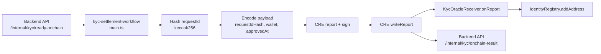

# KYC Workflow Overview

This workflow pulls approved KYC records from the backend, builds the report payload expected by `KycOracleReceiver`, writes via CRE `writeReport`, and posts settlement outcomes back to the backend.

## Architecture



## Runtime Flow

1. Cron trigger fires on configured `schedule`.
2. Workflow calls `GET /internal/kyc/ready-onchain?limit=maxBatch`.
3. For each returned record:
   - Compute `requestIdHash = keccak256(requestId)`.
   - Parse `approvedAt` timestamp to unix seconds.
   - ABI-encode `(bytes32 requestIdHash, address wallet, uint64 approvedAt)`.
   - Generate report and call `writeReport` to `KycOracleReceiver`.
4. Workflow posts `SUCCESS` or `RETRYABLE` to `POST /internal/kyc/onchain-result`.
5. If no records are returned, workflow exits with `{"processed":0}`.

## Key Config Fields

- `backendBaseUrl`: backend base URL for internal KYC endpoints.
- `kycReceiverAddress`: deployed `KycOracleReceiver` contract address.
- `chainSelectorName` / `isTestnet`: target chain selection.
- `gasLimit`: gas limit passed into `writeReport`.
- `maxBatch`: max records to claim per run.

## Current Staging Values

From `config.staging.json`:

- `backendBaseUrl`: `https://api.zawyafi.com`
- `chainSelectorName`: `ethereum-testnet-sepolia`
- `isTestnet`: `true`
- `kycReceiverAddress`: `0xe706556EeFc0d056A96868e1A38567d8fe3e9bf9`
- `maxBatch`: `25`

## Run

From `oracle-CRE-Integrations/kyc-settlement-workflow`:

```bash
bun x tsc --noEmit
```

From `oracle-CRE-Integrations`:

```bash
cre workflow simulate ./kyc-settlement-workflow --target staging-settings --non-interactive --trigger-index 0
```

Broadcast simulation:

```bash
cre workflow simulate ./kyc-settlement-workflow --target staging-settings --non-interactive --trigger-index 0 --broadcast -g -v
```

For large batches in local simulation, keep `maxBatch` low to avoid simulator HTTP action call limits.

## Troubleshooting

- `PerWorkflow.HTTPAction.CallLimit ... limit is 5`: lower `maxBatch` and rerun simulation/broadcast.
- `Invalid internal API token`: ensure `BACKEND_INTERNAL_TOKEN` matches backend `INTERNAL_API_TOKEN`.
- `failed to parse private key`: ensure `CRE_ETH_PRIVATE_KEY` is 64 hex chars (without `0x`).
