# Square Workflow Overview

This workflow reads daily Square activity, builds revenue reports per category, filters those reports by tokenized onchain categories for a specific batch, and sends signed writes to `OracleCoordinator`.

## Architecture

```mermaid
flowchart LR
  A["Square API<br/>payments + refunds"] --> B["square-workflow<br/>main.ts"]
  B --> C["Aggregate by category<br/>from payment note"]
  C --> D["Hash category names<br/>keccak256"]
  D --> E["Read onchain config"]

  E --> E1["OracleCoordinator<br/>settlementVault()"]
  E1 --> E2["SettlementVault<br/>factory() + isBatchFinished(batchId)"]
  E2 --> E3["ProductBatchFactory<br/>getBatchCategoryHashes(batchId)"]

  E3 --> F["Filter to tokenized categories"]
  F --> G["Build PeriodReport(s)"]
  G --> G1{"RevenueRegistry<br/>isPeriodRecorded(periodId)?"}
  G1 -- True --> G2["Skip Report"]
  G1 -- False --> H{"skipWrite?"}
  H -- true --> I["Log only / simulation"]
  H -- false --> J["CRE writeReport"]
  J --> K["OracleCoordinator.onReport"]
  K --> L["RevenueRegistry.recordPeriod"]
  K --> M["SettlementVault.settleCategoryRevenue"]
```



## Runtime Flow

1. Fetch Square payments and refunds for the configured window.
2. Infer category from each payment note, then compute `categoryHash = keccak256(categoryName)`.
3. Read onchain:
   - `settlementVault` and `revenueRegistry` from `OracleCoordinator`
   - `isBatchFinished(batchId)` from `SettlementVault`
   - `factory` and tokenized category hashes from `ProductBatchFactory`
4. Stop early if batch is finished.
5. Keep only categories that are tokenized for this batch.
6. Build one `PeriodReport` per eligible category with activity.
7. Check `isPeriodRecorded(periodId)` from `RevenueRegistry`. Skip any reports that are already onchain.
8. Submit `writeReport` to `OracleCoordinator` (unless `skipWrite=true`).

## Key Config Fields

- `merchantId`: merchant identifier string (example: `merchant-1`)
- `batchId`: onchain batch ID
- `oracleCoordinatorAddress`: deployed `OracleCoordinator` address
- `minEventCountForWrite`: skip low/no activity category writes
- `skipWrite`: simulation mode (`true`) vs onchain write mode (`false`)

## Current Staging Values

From `config.staging.json`:

- `merchantId`: `merchant-1`
- `batchId`: `1`
- `oracleCoordinatorAddress`: `0xDb4c31628Ff691d114863058F1034B54964dfD62`
- `chainSelectorName`: `ethereum-testnet-sepolia`

## Run

From `oracle-CRE-Integrations/square-workflow`:

```bash
bun x tsc --noEmit
```

From `oracle-CRE-Integrations`:

```bash
cre workflow simulate ./square-workflow --target staging-settings --non-interactive --trigger-index 0
```

Broadcast simulation:

```bash
cre workflow simulate ./square-workflow --target staging-settings --non-interactive --trigger-index 0 --broadcast
```

For real writes, set `skipWrite` to `false` in `config.staging.json` before the broadcast run.

## Troubleshooting

- `PerWorkflow.HTTPAction.CallLimit ... limit is 5`: reduce batch size / per-run workload and rerun.
- `failed to parse private key`: ensure `CRE_ETH_PRIVATE_KEY` is exactly 64 hex chars (without `0x`).
- Empty result / no writes: verify `batchId`, tokenized categories, and `skipWrite` value in config.
